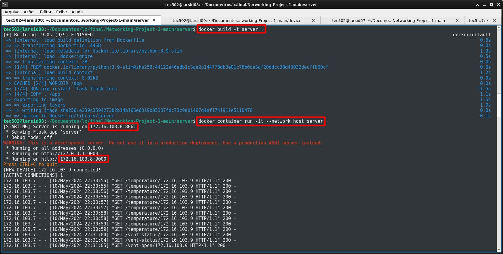
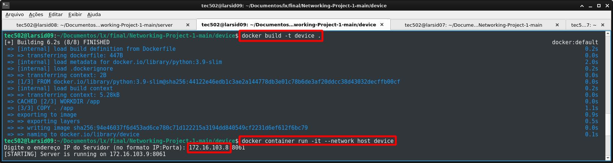
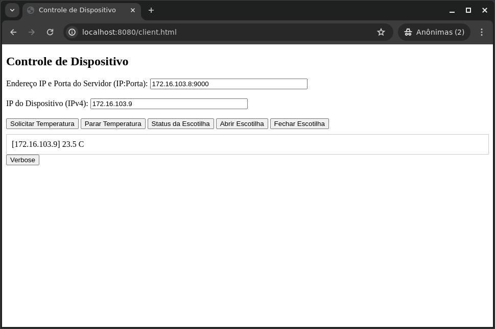

# Projeto de Rede 1: IoT
## Sistema de Controle de Ventilação e Temperatura para uma Estufa

# Descrição
Este software simula um dispositivo equipado com um sensor de temperatura que controla uma janela de ventilação em um ambiente de estufa. Ele opera por meio de uma arquitetura de broker-client, onde o dispositivo simulado se comunica com um broker. O cliente, por sua vez, interage com a janela de ventilação, via broker, gerenciando suas operações com base nas leituras de temperatura recebidas do dispositivo. Além disso, o sistema fornece dados de temperatura em tempo real em Celsius (°C) para monitorar efetivamente o ambiente da estufa. O dispositivo se comunica com o broker via TCP/IP usando sockets, enquanto o broker se comunica com o cliente via RESTFUL. O dispositivo oscila entre 17ºC e 32°C a uma taxa de 0,1°C/s. Quando a janela está "Fechada", a temperatura começa a subir a uma taxa de 0,1°C/s e quando a janela está "Aberta", ocorre o oposto.

## Requisitos
  * Docker instalado

# Instalação do Docker

Este guia fornece instruções sobre como instalar o Docker em diferentes sistemas operacionais.

## Instalação do Docker no Linux
   #### Ubuntu/Debian:
    1. Abra um terminal.
    2. Execute os seguintes comandos:
       ```bash
       sudo apt-get update
       sudo apt-get install docker.io
       sudo systemctl start docker
       sudo systemctl enable docker

   #### Para verificar se a instalação foi bem-sucedida, execute:
    docker --version 
    
## Instalação do Docker no Windows
    1. Baixe o instalador do Docker Desktop para Windows no site oficial do Docker: Docker Desktop for Windows
    2. Execute o instalador baixado e siga as instruções na tela.
    3. Após a instalação, o Docker Desktop será iniciado automaticamente. Aguarde até que o Docker Desktop seja totalmente inicializado.
    4. Verifique se a instalação foi bem-sucedida abrindo o PowerShell ou CMD e executando:
   #### bash:
     docker --version

## Instalação do Docker no macOS
    1. Baixe o instalador do Docker Desktop para macOS no site oficial do Docker: Docker Desktop for Mac
    2. Abra o arquivo .dmg baixado.
    3. Arraste o ícone do Docker para a pasta Aplicativos.
    4. Abra o Docker a partir do Launchpad ou Finder.
    5. O Docker será iniciado e estará disponível na barra de menus. Aguarde até que o Docker seja totalmente inicializado.
    6. Verifique se a instalação foi bem-sucedida abrindo o terminal e executando:
   #### bash:
     docker --version

   
## Como configurar o servidor usando Docker
   #### No terminal, digite:
    1. git clone https://github.com/alexsami-lopes/Digital-Systems-Project-1.git
    2. cd Digital-Systems-Project-1/server
    3. docker build -t server .
    4. docker container run -it --network host server

## Como configurar o dispositivo usando Docker
   #### No terminal, digite:
    1. git clone https://github.com/alexsami-lopes/Digital-Systems-Project-1.git
    2. cd Digital-Systems-Project-1/device
    3. docker build -t device .
    4. docker container run -it --network host device

## Como configurar o cliente usando Docker
   #### No terminal, digite:
    1. git clone https://github.com/alexsami-lopes/Digital-Systems-Project-1.git
    2. cd Digital-Systems-Project-1/clent
    3. docker build -t meu-nginx .
    4. docker run -d -p 8080:80 meu-nginx

## Como executar o cliente
   #### Na url do navegador, digite:
    1. http://localhost:8080/client.html
    
## Como configurar o cliente para se conectar ao servidor
   #### Na caixa "Endereço IP e Porta do Servidor (IP:Porta)", copie e cole o endereço do servidor Flask fornecido a você no terminal do servidor (na porta 9000), conforme visto na [Imagem do Servidor em uso](#image-of-the-server-in-use), exemplo:
    1. 172.16.103.8:9000

   #### Na caixa "IP do Dispositivo (IPv4)", copie e cole o endereço do dispositivo fornecido a você no terminal do dispositivo (sem porta), conforme visto na [Imagem do Dispositivo em uso](#image-of-the-device-in-use), exemplo:
    1. 172.16.103.9

### Clique em "Temperature" e em outros botões e aguarde alguns segundos para receber dados do dispositivo
[Imagem da GUI do Cliente em uso](#image-of-the-client-gui-in-use)

# Imagem do Servidor em uso


# Imagem do Dispositivo em uso


# Imagem da GUI do Cliente em uso



# Análise Final
 O objetivo deste projeto foi alcançado! Aprendi a usar sockets para comunicar usando conexões TCP e UDP, além de usar o Flask para fazer uma comunicação RESTFUL entre um cliente e um servidor e como criar uma arquitetura de broker-client.

# Material de pesquisa adicional usado neste projeto
 - [Retornar para a Tabela de Conteúdos](#table-of-contents)
