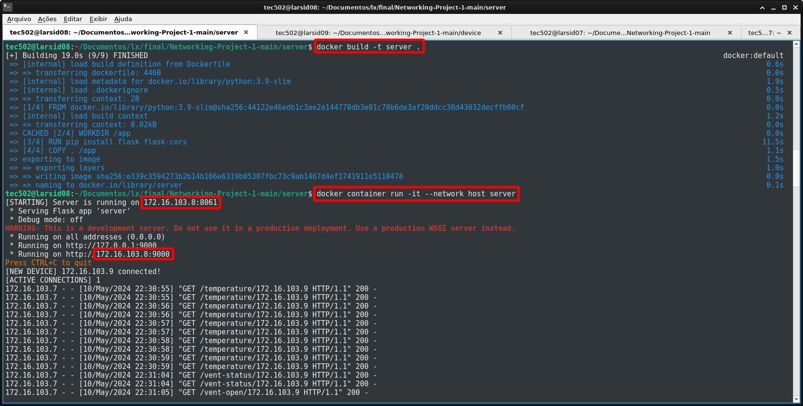
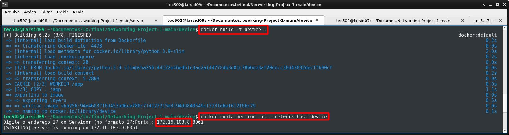
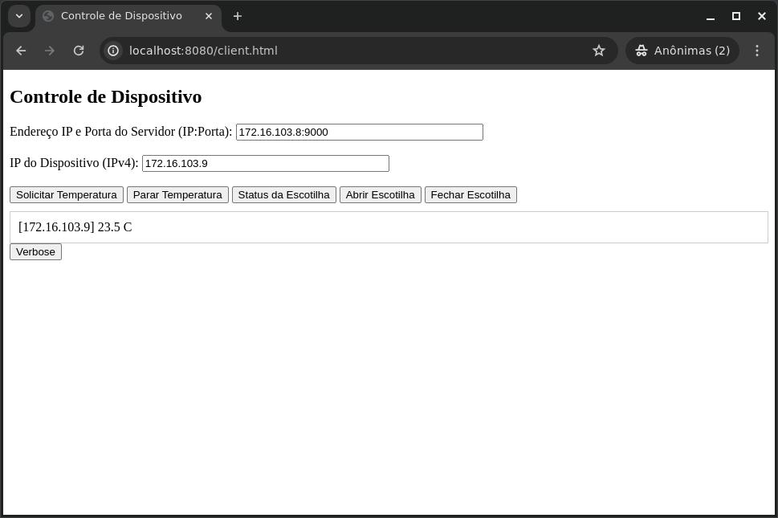

# [Versão em Português (Brazil)](README-PTbr.md)


---

# Networking Project 1: IoT
## Vent and Temperature Control System for a Greenhouse

# Description
This software simulates a device equipped with a temperature sensor that controls a roof vent in a greenhouse environment. It operates through a broker-client architecture, where the simulated device communicates with a broker. The client, in turn, interacts with the vent, via the broker, managing its operations based on temperature readings received from the device. Additionally, the system provides real-time temperature data in Celsius (°C) to monitor the greenhouse environment effectively. The device communicates with the broker via TCP/IP using sockets, while the broker communicates with the client via RESTFUL. The device oscillates between 17ºC and 32°C at a rate of 0.1°C/s. When the vent is "Closed" the temperature begin to rise at a rate of 0.1°C/s and when the vent is "Opened" the opposite.

## Table of Contents
1. [Description](#description)
2. [Requirements](#requirements)
3. [Docker Installation](#docker-installation)
   - [Docker Installation on Linux](#docker-installation-on-linux)
   - [Docker Installation on Windows](#docker-installation-on-windows)
   - [Docker Installation on macOS](#docker-installation-on-macos)
4. [How to set up the server using Docker](#how-to-set-up-the-server-using-docker)
5. [How to set up the device using Docker](#how-to-set-up-the-device-using-docker)
6. [How to set up the client using Docker](#how-to-set-up-the-client-using-docker)
7. [How to run the client](#how-to-run-the-client)
8. [How to set up the client to connect to the server](#how-to-set-up-the-client-to-connect-to-the-server)
9. [Final Analysis](#final-analysis)
10. [Additional research material used in this project](#additional-research-material-used-in-this-project)

## Requirements
  * Docker installed

# Docker Installation

This guide provides instructions on how to install Docker on different operating systems.

## Docker Installation on Linux
   #### Ubuntu/Debian:
    1. Open a terminal.
    2. Run the following commands:
       ```bash
       sudo apt-get update
       sudo apt-get install docker.io
       sudo systemctl start docker
       sudo systemctl enable docker

   #### To verify if the installation was successful, run:
    docker --version 
    
## Docker Installation on Windows
    1. Download the Docker Desktop installer for Windows from the official Docker website: Docker Desktop for Windows
    2. Run the downloaded installer and follow the on-screen instructions.
    3. After installation, Docker Desktop will start automatically. Wait until Docker Desktop is fully initialized.
    4. Verify if the installation was successful by opening PowerShell or CMD and running:
   #### bash:
     docker --version

## Docker Installation on macOS
    1. Download the Docker Desktop installer for macOS from the official Docker website: Docker Desktop for Mac
    2. Open the downloaded .dmg file.
    3. Drag the Docker icon to the Applications folder.
    4. Open Docker from Launchpad or Finder.
    5. Docker will start and will be available in the menu bar. Wait until Docker is fully initialized.
    6. Verify if the installation was successful by opening the terminal and running:
   #### bash:
     docker --version

   
## How to set up the server using Docker
   #### On the terminal type:
    1. git clone https://github.com/alexsami-lopes/Digital-Systems-Project-1.git
    2. cd Digital-Systems-Project-1/server
    3. docker build -t server .
    4. docker container run -it --network host server

## How to set up the device using Docker
   #### On the terminal type:
    1. git clone https://github.com/alexsami-lopes/Digital-Systems-Project-1.git
    2. cd Digital-Systems-Project-1/device
    3. docker build -t device .
    4. docker container run -it --network host device

## How to set up the client using Docker
   #### On the terminal type:
    1. git clone https://github.com/alexsami-lopes/Digital-Systems-Project-1.git
    2. cd Digital-Systems-Project-1/clent
    3. docker build -t meu-nginx .
    4. docker run -d -p 8080:80 meu-nginx

## How to run the client
   #### On the browser url type:
    1. http://localhost:8080/client.html
    
## How to set up the client to connect to the server
   #### On the "Endereço IP e Porta do Servidor (IP:Porta)" box copy and past the address of the server Flask given to you in your server terminal (in port 9000) as seen on the [Image of the Server in use](#image-of-the-server-in-use) in use, example:
    1. 172.16.103.8:9000

   #### On the "IP do Dispositivo (IPv4)" box copy and past the address of the device given to you in your device terminal (without port) as seen on the [Image of the Device in use](#image-of-the-device-in-use) in use, example:
    1. 172.16.103.9

### Click on "Temperature" and other butons and wait a few seconds to receive data from the device
[Image of the Client GUI in use](#image-of-the-client-gui-in-use)

# Image of the Server in use


# Image of the Device in use


# Image of the Client GUI in use


# Final Analysis
 The objective of this project was achieved! I've learned how to use sockets to communicate using TCP and UDP connections, as well as using Flask to make a RESTFUL communication between a client and a server and how to create a broker-client architecture.

# Additional research material used in this project


 - [Return to Table of Contents](#table-of-contents)


